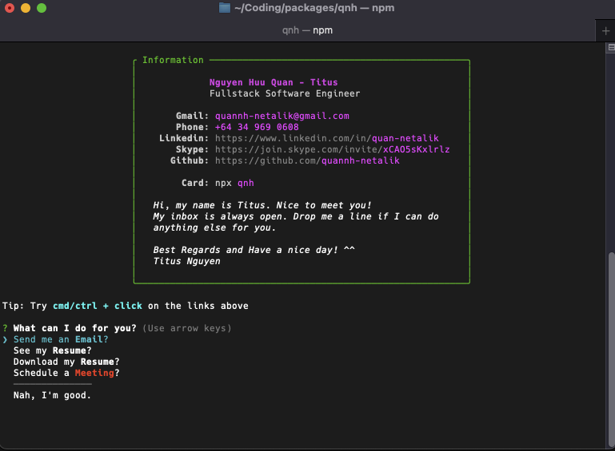

# <center>npx titus</center>

## <center>Built with ☕️ and ❤️ by <a href='https://github.com/quannh-netalik'>Titus</a>.</center>

<br />

<center>
  An easy way to connect with Titus directly from your console or terminal 👨‍💻.
</center>

👇️ just hit

```bash
npx qnh
```



## License

npx card is licensed under the terms of [MIT](https://choosealicense.com/licenses/mit/)
